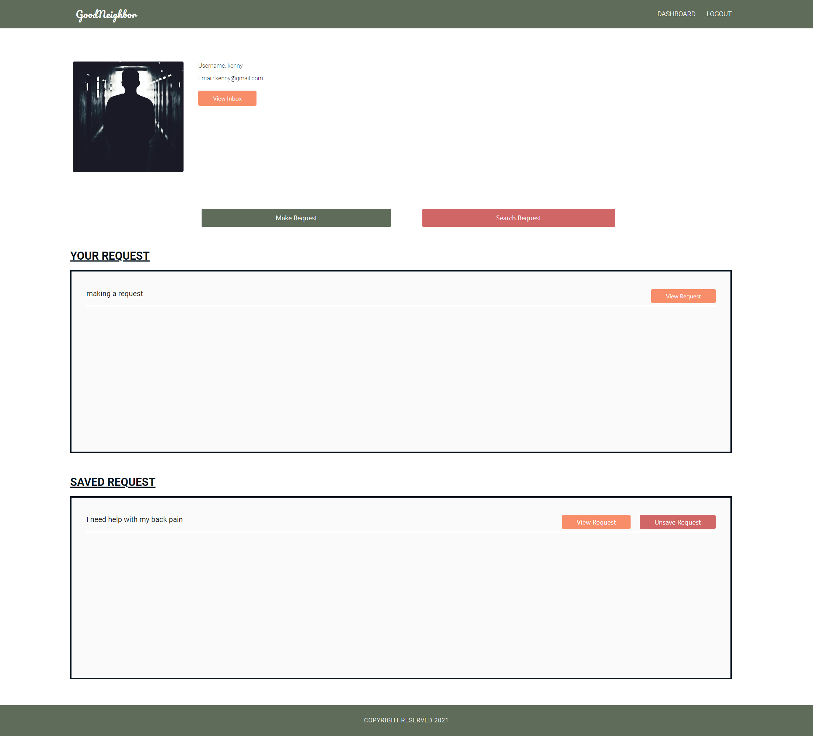
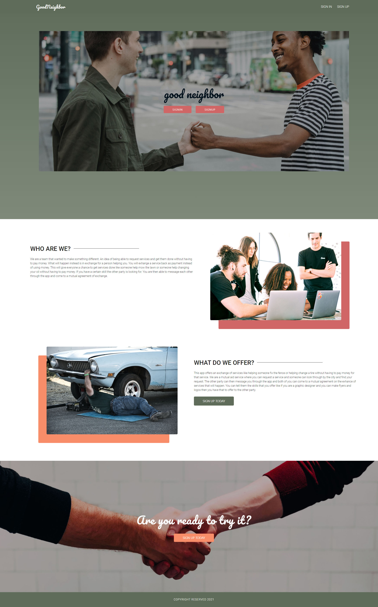
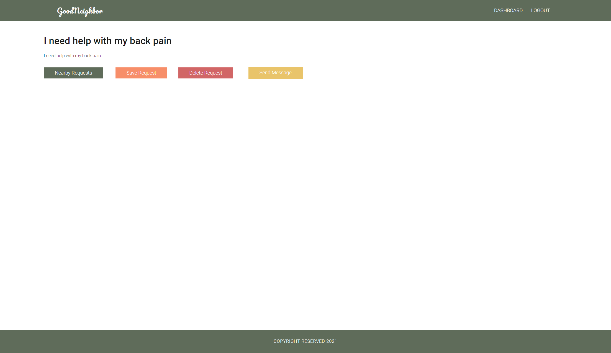
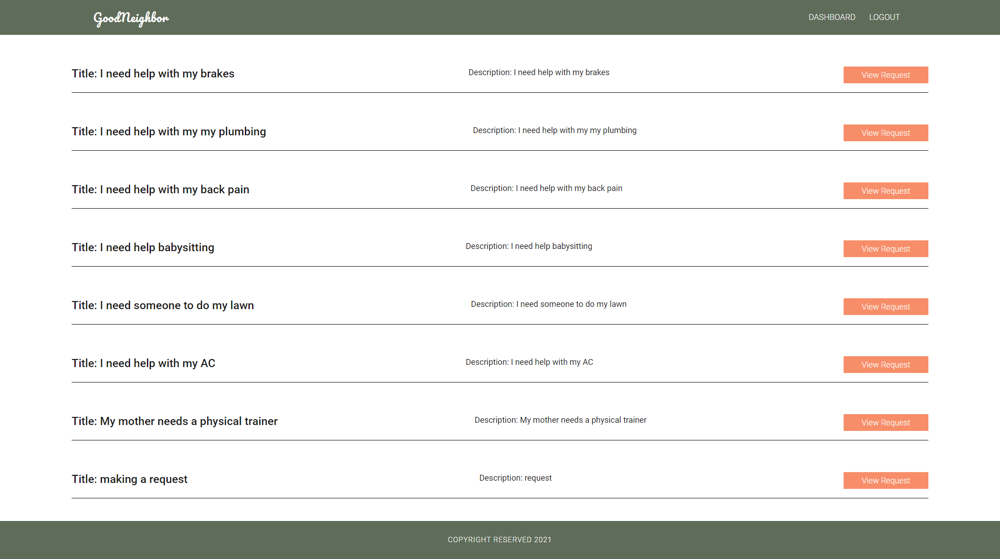

# Good Neighbor
 

## Description 📝 
---
Good Neighbor is a community-driven service exchange app built with express, sequelize, and handlebars. Users can make requests and message each other, with full login functionality, and requests being grouped by city/town (future versions will utilize a third-party API to search for requests). Users can also save requests to their dashboard so as to refer to them later. Unless a user is logged in, they can only visit the homepage and login/signup pages. The application is deployed to Heroku and uses JawsDB MySQL/ 📝

## Table of Contents  
---
- [Installation Instructions ⌨️](#installation-⌨️)
- [Usage 🖥️](#usage-🖥️)
- [Screenshot & Video 📸](#screenshot--video-📸-click-on-screenshot-to-see-video)
- [Contributors 📜](#contributors-📜)
- [Contact 📠](#contact-📠)
- [License 📋](#license-📋)

## Installation ⌨️ 
---
To use the app on your local machine with dummy data, clone the repository and run npm i-y and make a .env file with the relevant values so the app can communicate with your MySQL database (goodneighbor_db). Run npm run seed to seed the database with the dummy data, then npm start to start the app. ⌨️
  
## Usage 🖥️ 
---
Add user story here 🖥️
  
## Contributors 📜 
---
Kenny Cheng, Kyaah Ellis, Rudie G (Rauol Moore), and Ryan Hillier 📜
  
## Screenshot 📸 
---
Dashboard
 |
 
 
Homepage
 |
 
 
View Request
 |
 
 
Search Request
 |
 
 

## Contact 📠 
---
 
GitHub: https://github.com/rudie-g
 
 
Email: rauoldm@gmail.com
 
 

## License 📋

---
 
This application is covered by <a href="https://opensource.org/licenses/BSD-3-Clause"> 3-clause BSD License</a> license.
